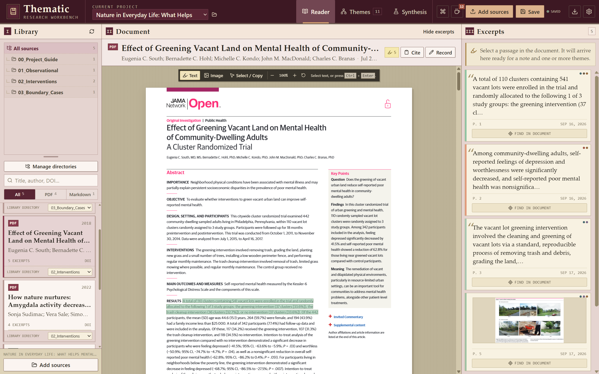
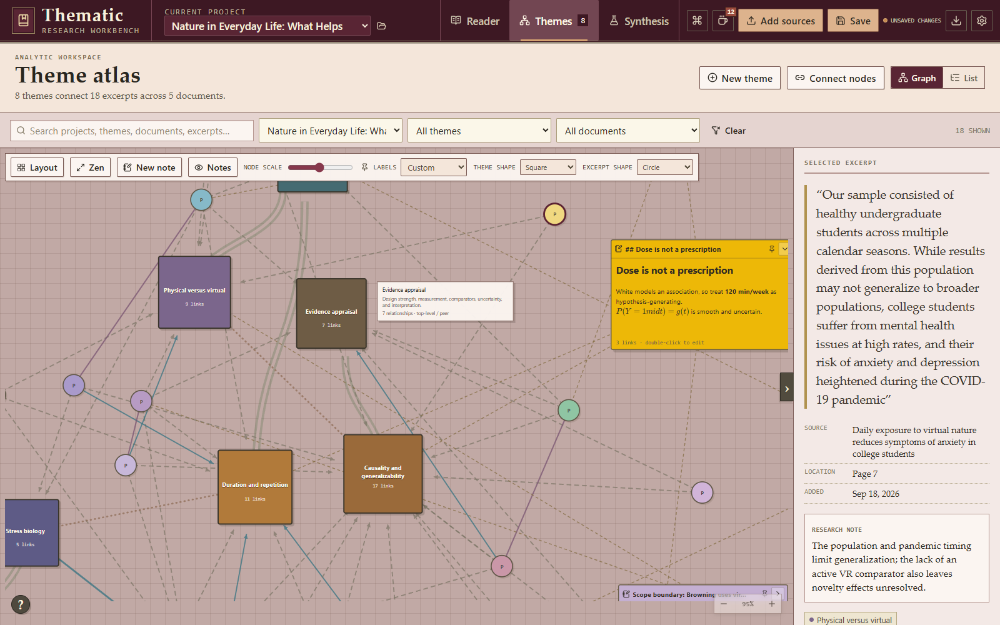
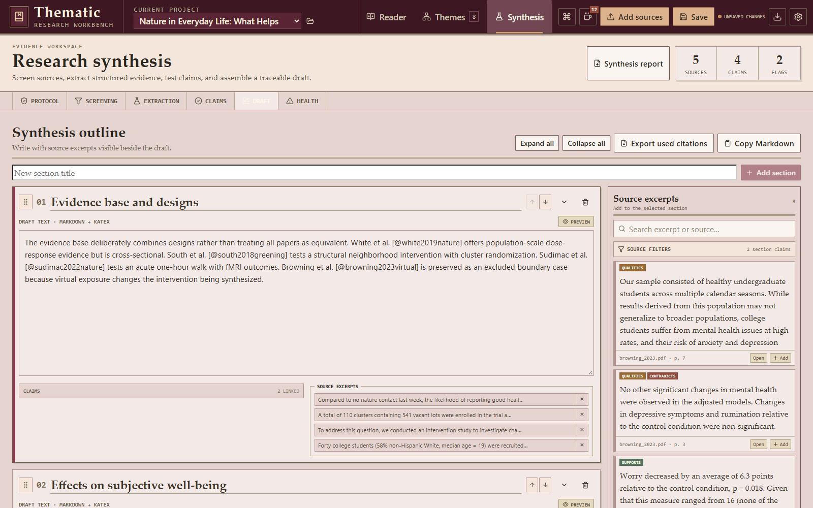

# Thematic

**A research workbench for organizing sources, analyzing themes, and building traceable evidence syntheses.**

Thematic brings PDF and Markdown reading, excerpt capture, thematic mapping, citation management, and structured synthesis into one desktop workspace. Move from source material to defensible claims without losing the connection to the original evidence.



## What you can do

- Organize multiple research projects and source libraries.
- Read PDF and Markdown documents inside the workspace.
- Capture anchored text excerpts and image regions with notes and colors.
- Build editable theme hierarchies and explicit relationships between themes and excerpts.
- Explore evidence visually through a draggable, filterable theme atlas.
- Track screening decisions and structured evidence extraction.
- Develop claims and draft synthesis sections beside their supporting excerpts.
- Copy formatted citations and parse BibTeX or BibLaTeX records.
- Export project data to CSV, XLSX, SQLite, ZIP, or a portable `.thematic` bundle.
- Optionally use an Ollama or llama.cpp model to suggest themes for review.

## Explore themes and relationships

The Theme atlas connects themes, excerpts, documents, and analytic notes. Filter the graph, inspect relationship direction, adjust its layout, or open any excerpt back in the reader.



## Build a traceable synthesis

The synthesis workspace keeps review protocol, screening, extraction, claims, source excerpts, and draft sections together. Each section can retain direct links to the evidence used to support or qualify it.



## Example project

The repository includes a complete portable showcase:

[`Nature-in-Everyday-Life--What-Helps-Mental-Well-Being-.thematic`](example/Nature-in-Everyday-Life--What-Helps-Mental-Well-Being-.thematic)

It contains five documents, 18 excerpts, eight themes, a populated relationship graph, screening and extraction records, claims, and a four-section synthesis draft. The screenshots above were captured from this project.

To open it in Thematic:

1. Launch the desktop application.
2. Open **Manage projects** from the folder button beside the current project.
3. Select **Import .thematic project**.
4. Choose the file from the `example` directory.

> [!NOTE]
> A `.thematic` bundle can include copies of its source documents. Review a bundle before sharing it outside its intended audience.

## Installation

1. Download the latest Windows installer from [GitHub Releases](https://github.com/ermati-3e2g/thematic/releases/latest).
2. Run the downloaded `Thematic_*_x64-setup.exe` file and follow the installer prompts.

The release also includes the optional `Nature-in-Everyday-Life--What-Helps-Mental-Well-Being-.thematic` example project. After installing Thematic, download this file from the same release and import it through **Manage projects -> Import .thematic project** to explore a populated workspace.

> [!WARNING]
> The Windows installer is currently **not code-signed**. Windows Defender SmartScreen may therefore show an **Unknown publisher** warning. Only install Thematic when it was downloaded from this repository's official GitHub Releases page, and verify the SHA-256 checksum published with the release before running it.

## Start a project from scratch

You can begin with only a project name and one document; there is no need to design a complete theme structure first.

1. **Create a project.** Select the folder button beside **Current project** to open **Manage projects**. Enter a name under **Create another project**, then select **Create project**. The new project opens automatically.
2. **Add your reading material.** Select **Add sources** in the header. Choose **Folder** to index every supported file in a folder, or **One or more files** to add a smaller selection. Thematic supports PDF and Markdown sources.
3. **Open a document.** In the **Reader** workspace, select a document from the Library and begin reading.
4. **Capture your first excerpt.** Keep the **Text** tool selected, highlight a useful passage, add an optional research note, then select **Save excerpt**. Repeat this whenever a passage contributes evidence, context, or a question worth retaining.
5. **Develop themes as patterns emerge.** Open **Themes**, select **New theme**, and give the theme a clear name and optional description. Open saved excerpts to associate them with one or more themes.
6. **Create a recovery point.** Select **Save** in the header or press `Ctrl+S`. When the project is ready to back up or share, open **Manage projects** and select **Export .thematic**.

> [!TIP]
> Start with a few documents and a small set of broad themes, then refine them as you read. Thematic indexes your original PDF and Markdown files but does not modify them.

## Development

### Prerequisites

- Node.js
- [pnpm](https://pnpm.io/)
- The Rust toolchain
- The [Tauri 2 platform prerequisites](https://v2.tauri.app/start/prerequisites/)

Install dependencies and start the desktop app:

```powershell
pnpm install
pnpm tauri dev
```

Run the browser development surface:

```powershell
pnpm dev
```

## Production build

```powershell
pnpm tauri build
```

The current bundle configuration produces a Windows NSIS installer.

## Technology

- React and TypeScript
- Vite
- Tauri 2 and Rust
- SQLite via `rusqlite`
- PDF.js, KaTeX, and ELK

## AI-assisted development declaration

Thematic has been built using AI-assisted development practices, sometimes described as "vibe coding." AI tools have contributed to planning, implementation, debugging, design iteration, and documentation. The maintainer directs the project and remains responsible for evaluating, maintaining, and releasing the resulting software. This disclosure is included so users and contributors can make an informed assessment of the project and its code.
